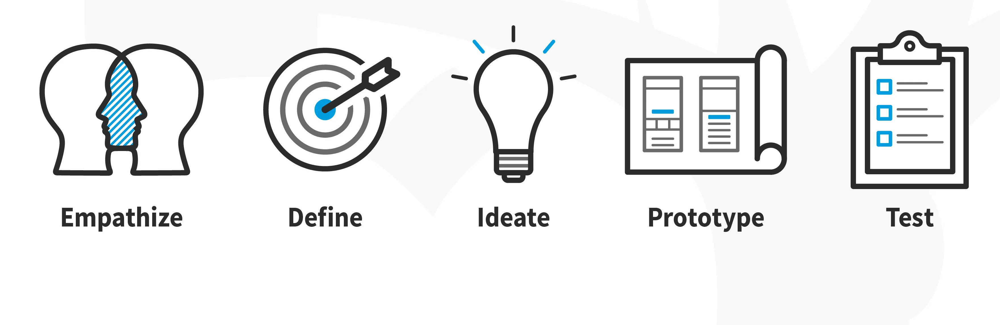

## **Analysis & Design**

- Presented by: SUIRITA Fahd
- Framed by: ESSARRAJ Fouad

---

### **1. Introduction**

---

### **2. Pkg-validation:**

---

### **3. Learning:**

---

### **4. Design thinking:**

---

### **5. Planning:**

<table style="font-size: 42px" >
  <tr>
    <th></th>
    <th>1</th>
    <th>2</th>
    <th>3</th>
  </tr>
  <tr>
    <td>Monday</td>
    <td>Tuto-1</td>
    <td>Tuto-2</td>
    <td>Tuto-3</td>
  </tr>
  <tr>
    <td>Tuesday</td>
    <td>-</td>
    <td>-</td>
    <td>Empathy</td>
  </tr>
  <tr>
    <td>Wednesday</td>
    <td>Define</td>
    <td>ideate</td>
    <td>Prototype</td>
  </tr>
  <tr>
    <td>Thursday</td>
    <td>Prototype</td>
    <td>File_rouge</td>
    <td>Prototype</td>
  </tr>
  <tr>
    <td>Friday</td>
    <td>Test</td>
    <td>Test</td>
    <td>File_rouge</td>
  </tr>
</table>

---

### **6. Empathy:**

---

### **7. Define:**

---

### **8. ideate:**

---

### **9. Prototype:**

#### **1. Class diagram:**

|||

### **9. Prototype:**

#### **2. Prototype:**

---

### **10. Conclusion:**
